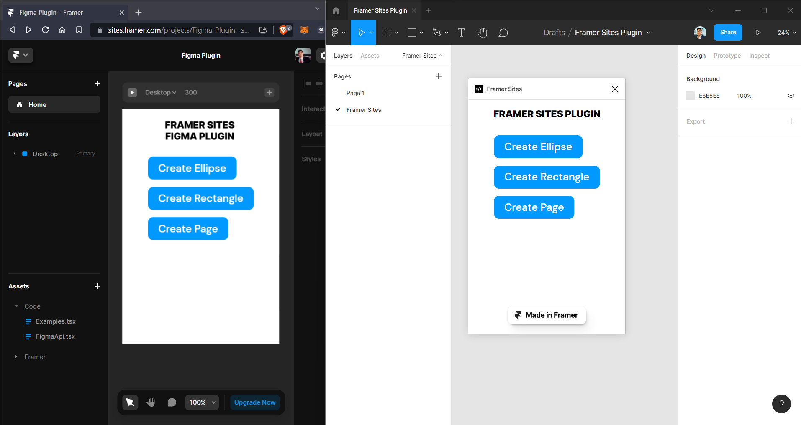

# Framer Sites Figma Plugin 

Build figma plugin with low code using framer sites



## Framer Sites

Duplicate [this framer site](https://sites.framer.com/projects/new?duplicate=sUTqiLD13aV9nhuIt1gz)

### Code Override

`Examples.tsx`

```typescript
import { figma, postFigmaMessage } from "./FigmaApi.tsx"

export function createEllipse(Component): ComponentType {
    return (props) => {
        return (
            <Component
                {...props}
                onClick={async () => {
                    postFigmaMessage(() => {
                        let ellipse = figma.createEllipse()
                        ellipse.resize(300, 300)
                    })
                }}
            />
        )
    }
}

export function createRectangle(Component): ComponentType {
    return (props) => {
        return (
            <Component
                {...props}
                onClick={async () => {
                    postFigmaMessage(() => {
                        let ellipse = figma.createRectangle()
                        ellipse.resize(300, 300)
                    })
                }}
            />
        )
    }
}

export function createPage(Component): ComponentType {
    return (props) => {
        return (
            <Component
                {...props}
                onClick={async () => {
                    postFigmaMessage(() => {
                        figma.createPage()
                    })
                }}
            />
        )
    }
}
```

Assigning code override


Autocomplete


## Figma Plugin

clone [figma plugin examples](https://github.com/figma/plugin-samples/tree/master/webpack-react): `webpack-react`

install framer-sites-figma-plugin

```
yarn add framer-sites-figma-plugin
```

`ui.tsx`

```typescript
import useFramerMessage from "framer-sites-figma-plugin";

const App = () => {
  useFramerMessage();
  return (
    <iframe
      src="https://figmaplugin.framer.website/" // your framer sites url
      loading="lazy"
      style={{ width: "100%", height: "100%", border: "none" }}
    ></iframe>
  );
};
```

`code.tsx`

```typescript
import framerOnMessage from "framer-sites-figma-plugin/lib/api";

figma.ui.onmessage = (msg) => {
  framerOnMessage(msg);
};
```